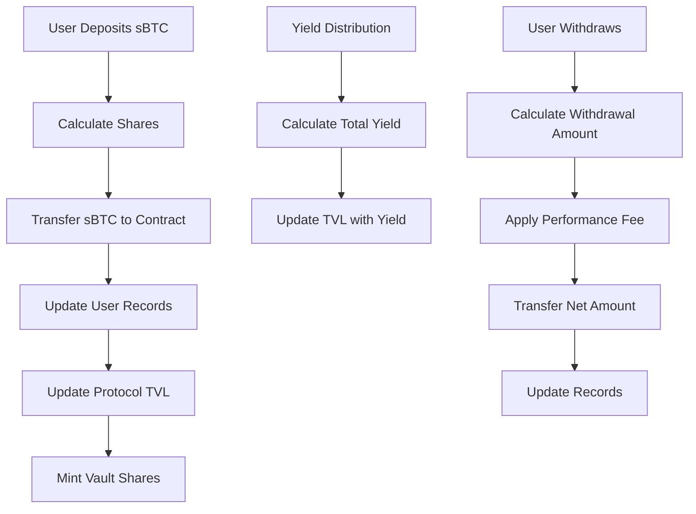
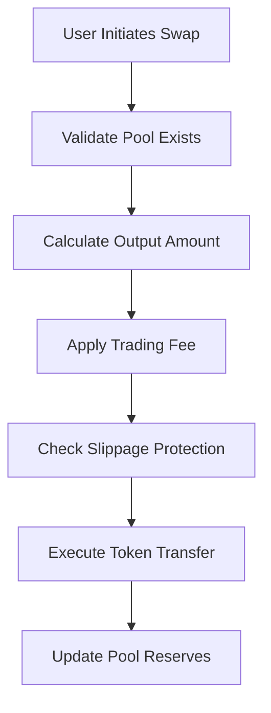
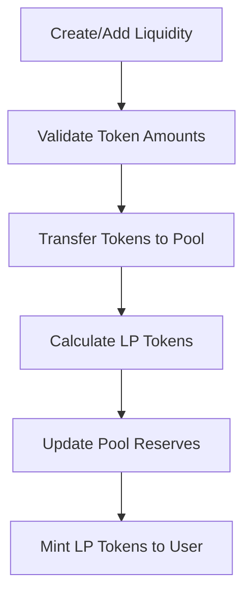

# BitVault Protocol

> Advanced sBTC Yield Farming & Automated Market Maker Protocol

BitVault is a comprehensive DeFi protocol that enables sBTC holders to maximize returns through automated yield farming strategies, liquidity provision, and decentralized trading on the Stacks blockchain with Bitcoin-native security guarantees.

## 🚀 Features

- **Automated Yield Vaults**: Deploy sBTC into optimized farming strategies with institutional-grade security
- **Liquidity Mining**: Earn trading fees as a liquidity provider in sBTC trading pairs
- **AMM Trading**: Swap sBTC with other tokens using constant product market maker formulas
- **Risk Management**: Built-in slippage protection and emergency controls
- **Scalable Architecture**: Designed for Stacks Layer 2 efficiency

## 📋 System Overview

BitVault leverages Stacks' unique position as Bitcoin's smart contract layer to bring sophisticated DeFi primitives to the world's most secure blockchain network. The protocol combines three core components:

1. **Yield Farming Vaults** - Users deposit sBTC to earn automated yield
2. **Automated Market Maker (AMM)** - Provides decentralized token swapping functionality
3. **Liquidity Provision** - Users can provide liquidity to earn trading fees

### Key Metrics

- **Minimum Deposit**: 0.001 sBTC
- **Performance Fee**: 1% (100 basis points)
- **Trading Fee**: 0.3%
- **Default APY**: 5%
- **Precision**: 6 decimal places for high-precision calculations

## 🏗️ Contract Architecture

### Core Components

```
BitVault Protocol
├── Vault Operations
│   ├── deposit-to-vault()
│   ├── withdraw-from-vault()
│   └── distribute-yield()
├── AMM Operations
│   ├── create-liquidity-pool()
│   ├── add-liquidity()
│   └── swap-sbtc-for-token()
├── Administrative Controls
│   ├── set-vault-pause()
│   ├── set-yield-rate()
│   └── add-authorized-caller()
└── Read-Only Interfaces
    ├── get-user-vault-balance()
    ├── get-pool-info()
    └── get-total-value-locked()
```

### Data Structures

#### User Data Maps

- `user-deposits`: Tracks individual user deposit amounts
- `user-shares`: Tracks vault share ownership
- `user-last-deposit-time`: Records deposit timestamps
- `user-lp-tokens`: Tracks LP token balances per pool

#### Protocol Data Maps

- `liquidity-pools`: Stores AMM pool reserves and metadata
- `authorized-callers`: Access control for administrative functions

#### State Variables

- `vault-paused`: Emergency pause mechanism
- `total-value-locked`: Protocol TVL tracking
- `yield-rate`: Current yield distribution rate
- `admin`: Administrative control principal

## 🔄 Data Flow

### Vault Operations Flow



### AMM Trading Flow



### Liquidity Provision Flow



## 🛠️ Core Functions

### Vault Operations

#### `deposit-to-vault(amount: uint)`

Deposits sBTC into the yield farming vault and mints proportional shares.

**Parameters:**

- `amount`: Amount of sBTC to deposit (minimum 0.001 sBTC)

**Returns:**

- Number of vault shares minted

#### `withdraw-from-vault(shares: uint)`

Withdraws sBTC from the vault by burning shares, applies 1% performance fee.

**Parameters:**

- `shares`: Number of vault shares to burn

**Returns:**

- Net sBTC amount withdrawn (after fees)

### AMM Operations

#### `create-liquidity-pool(token-b, sbtc-amount, token-b-amount)`

Creates a new trading pair with sBTC as the base token.

#### `swap-sbtc-for-token(token-b, sbtc-amount, min-token-b-out)`

Executes a token swap using the constant product formula with slippage protection.

### Administrative Functions

#### `set-vault-pause(paused: bool)`

Emergency pause mechanism for vault operations (admin only).

#### `set-yield-rate(new-rate: uint)`

Updates the protocol yield distribution rate (admin only).

## 📊 Read-Only Functions

### `get-user-vault-balance(user: principal)`

Returns user's current vault balance including accrued yield.

### `get-pool-info(token-b: principal)`

Returns comprehensive pool information including reserves and fees.

### `get-total-value-locked()`

Returns the protocol's total value locked across all vaults.

### `get-vault-status()`

Returns current vault status including pause state and yield rate.

## 🔒 Security Features

- **Access Control**: Multi-level authorization system
- **Emergency Pause**: Admin can halt vault operations
- **Slippage Protection**: User-defined minimum output amounts
- **Input Validation**: Comprehensive parameter checking
- **Emergency Recovery**: Admin-only token recovery mechanism

## ⚡ Error Codes

| Code | Error | Description |
|------|-------|-------------|
| 400 | ERR_NOT_AUTHORIZED | Insufficient permissions |
| 401 | ERR_INSUFFICIENT_BALANCE | Insufficient user balance |
| 402 | ERR_MIN_DEPOSIT_NOT_MET | Below minimum deposit threshold |
| 403 | ERR_VAULT_PAUSED | Vault operations are paused |
| 404 | ERR_INVALID_AMOUNT | Invalid input amount |
| 405 | ERR_SLIPPAGE_EXCEEDED | Slippage tolerance exceeded |
| 406 | ERR_POOL_NOT_FOUND | Trading pool doesn't exist |
| 407 | ERR_INSUFFICIENT_LIQUIDITY | Insufficient pool liquidity |

## 🚀 Getting Started

### Prerequisites

- Stacks blockchain access
- sBTC tokens for testing/deployment
- Clarity smart contract development environment

### Deployment

1. Deploy the BitVault contract to Stacks testnet/mainnet
2. Initialize the protocol using `initialize()`
3. Set up authorized callers for yield distribution
4. Configure initial yield rates and parameters

### Usage Examples

```clarity
;; Deposit 1 sBTC into vault
(contract-call? .bitvault deposit-to-vault u1000000)

;; Create a new trading pool
(contract-call? .bitvault create-liquidity-pool 
  .token-contract u500000 u1000000)

;; Swap 0.1 sBTC for tokens with 5% slippage tolerance
(contract-call? .bitvault swap-sbtc-for-token 
  .token-contract u100000 u95000)
```

## 📈 Yield Calculation

Vault shares represent proportional ownership of the total vault value. As yield is distributed, the total value locked increases, making each share worth more sBTC over time.

**Share Value = Total Value Locked / Total Shares Outstanding**

## 🔧 Configuration

### Constants

- `MIN_DEPOSIT`: 1,000 (0.001 sBTC)
- `VAULT_FEE_BPS`: 100 (1%)
- `PRECISION`: 1,000,000 (6 decimals)
- `DEFAULT_YIELD_RATE`: 500 (5% APY)
- `DEFAULT_TRADING_FEE`: 30 (0.3%)

## 📄 License

This project is licensed under the MIT License - see the [LICENSE](LICENSE) file for details.

## 🤝 Contributing

Contributions are welcome! Please read our [Contributing Guidelines](CONTRIBUTING.md) for details on our code of conduct and the process for submitting pull requests.
